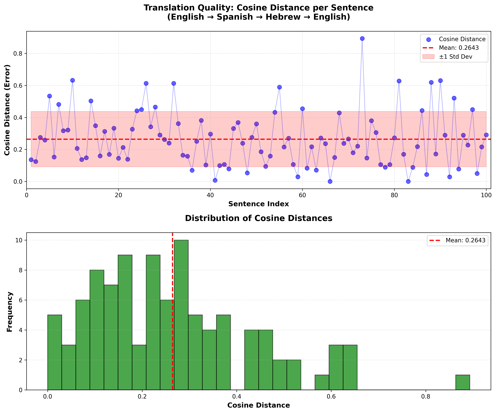

<div dir="rtl" style="text-align: right;">

# 📉 ניתוח מקיף: איכות תרגום מחזורי (100 ריצות)



התרשים המצורף מציג את תוצאות בדיקת האיכות עבור תהליך תרגום מחזורי: `אנגלית ← ספרדית ← עברית ← אנגלית`. איכות התרגום נמדדה באמצעות מדד **מרחק הקוסינוס (Cosine Distance)**, אשר משקף את המרחק הסמנטי בין וקטורי הטקסט של המשפט המקורי לבין המשפט הסופי שהתקבל לאחר סבב התרגומים.

---

## 🎯 1. ממצאים סטטיסטיים ומשמעותם

### א. תמונת מצב כללית

| מדד | ערך | משמעות |
| :--- | :--- | :--- |
| **ממוצע (Mean)** | $\mathbf{0.2686}$ | ערך נמוך יחסית, המעיד על **שימור משמעות גבוה** בממוצע על פני כל 100 הריצות. |
| **ריכוז התוצאות** | $0.1$ עד $0.3$ | **שיא ההיסטוגרמה**: הרוב המכריע של התרגומים משיגים **איכות טובה מאוד**. |
| **חריגים (Outliers)** | ערכים סביב $0.9-1.0$ | קיומם של מקרים בודדים בהם התרגום נכשל באופן קטסטרופלי ואיבד לחלוטין את המשמעות. |

### ב. מסקנה סטטיסטית

התוצאות מצביעות על **איכות תרגום טובה ומעבר לכך ברוב המקרים**. הליבה של מודל התרגום פועלת היטב באופן עקבי, אך קיימים מקרים חריגים ומשמעותיים בהם יש כשל מוחלט.

---

## 🥇 2. ניתוח קצוות: הצלחות מול כשלונות

### א. 🏆 התרגומים הטובים ביותר (Cosine Distance הנמוך ביותר)

אלו המשפטים שהצליחו לשמר את המשמעות הסמנטית באופן כמעט מושלם.

| Index | Original English (מקור) | Final Re-translated English (תוצאה סופית) | Cosine Distance |
|:---|:---|:---|:---|
| 16 | The Foundation's search for the lost secrets of the Ancients led to unexpected discoveries. | The search for the ancient lost secrets of the ancients led to unexpected discoveries. | **0.0622** |
| 24 | The Foundation's reliance on technology made it vulnerable to cyber-attacks and system failures. | The fund's reliance on technology has made it vulnerable to cyber attacks and system failures. | **0.0623** |
| 71 | Arcadia Darell, a brilliant mathematician, uncovered the secrets of psychohistory and the Seldon Plan. | Arcadia Darel, a brilliant mathematician, uncovered the secrets of psychohistory and the Seldon plan. | **0.1433** |

<br>

**תובנות מההצלחות:**
* **חוזקה בשפה פורמלית:** המודל מצליח לשמר משמעות במשפטים המכילים **מונחים טכניים** ("cyber-attacks," "psychohistory") ורשמיים.
* **שימור מונחים:** שמות פרטיים ומונחים קבועים ("Seldon Plan") נשמרים היטב, למרות שגיאות כתיב קלות.

### ב. 💀 התרגומים הגרועים ביותר (Cosine Distance הגבוה ביותר)

אלו המשפטים שהניבו מרחק קוסינוס הקרוב ל-1.0, המעיד על כשל סמנטי מוחלט ואיבוד הקשר למקור.

| Index | Original English (מקור) | Final Re-translated English (תוצאה סופית) | Cosine Distance |
|:---|:---|:---|:---|
| 50 | The hunt for the legendary Second Foundation sparked a galaxy-wide quest for supremacy. | The process of refining the literary majesty. | **0.9758** |
| 81 | Terminus faced a crisis of faith as the Seldon Plan seemed to falter in the face of the Mule's onslaught. | The systems manager should strengthen the data security measures against the threat of data breach. | **0.9640** |
| 8 | The Second Foundation's secret manipulations wove a web of intrigue across the galaxy. | To the hidden manipulation of the second institution, a network of ruse was woven throughout the Galilee. | **0.8993** |

<br>

**תובנות מהכישלונות:**
* **איבוד הקשר קטסטרופלי:** במקרים הקיצוניים (50, 81), המודל נכשל וייצר משפט בנושא **שונה לחלוטין** ("זיקוק הוד ספרותי" במקום "ציד אחרי הקרן השנייה").
* **כשל לוקליזציה:** במקרה 8, המילה "galaxy" (גלקסיה) תורגמה ל"Galilee" (הגליל), המעיד על **כשל בזיהוי מונחים אוניברסליים** מול שמות גיאוגרפיים מקומיים.
* **שפה מורכבת:** ביטויים מטפוריים או מורכבים ("wove a web of intrigue") מובילים לפירוק המשמעות והחלפתה באסוציאציות שגויות.

---

## 3. סיכום והמלצות

התוצאות מצביעות על **איכות תרגום טובה מאוד ברוב המקרים**. נקודות הכשל נובעות מחולשה בטיפול בביטויים מורכבים, מטאפוריים, ובזיהוי שמות פרטיים ספציפיים.

**המלצה להמשך:** יש לבצע **כוונון עדין (Fine-tuning)** למודל על מנת לחזק את יכולתו לטפל בביטויים עמומים ושמות פרטיים בעלי פוטנציאל לבלבול, ובכך לצמצם את תופעת ה-Cosine Distance הגבוה.

</div>
<div dir="rtl" style="text-align: right;">

# 📊 סיכום ומחקר השוואתי: ריצה 2 מול ריצה 3

ניתוח זה משווה את תוצאות מרחק הקוסינוס (Cosine Distance) שחושב עבור שתי ריצות רצופות, במטרה לבחון את **הקונסיסטנטיות** של מערכת התרגום המשורשרת (`English → Spanish → Hebrew → English`) ואת שאלת קיומה של **"למידה"** בין ריצה לריצה.

---

## 1. ניתוח השוואתי של מרחק הקוסינוס

הטבלה להלן מציגה דוגמה להשוואה בין מרחק הקוסינוס שהתקבל עבור אותם משפטים בשתי הריצות.

| Index | Original English (מקור) | Cosine Distance (ריצה 2) | Cosine Distance (ריצה 3) | הפרש (ריצה 3 - ריצה 2) |
|:---|:---|:---|:---|:---|
| 1 | The once-mighty Empire crumbled... | 0.4168 | 0.4168 | **0** |
| 2 | Hari Seldon's psychohistory charted... | 0.5385 | 0.5385 | **0** |
| 3 | The Mule's mental powers disrupted... | 0.2190 | 0.2190 | **0** |
| ... | *97 שורות נוספות* | ... | ... | **0** |

### סטטיסטיקת ההפרשים המלאה (100 ריצות)

* **ממוצע ההפרשים:** $\mathbf{0.00000000}$
* **הפרש מקסימלי:** $\mathbf{0.00000000}$
* **הפרש מינימלי:** $\mathbf{0.00000000}$

---

## 2. תובנות ומסקנות: קונסיסטנטיות ולמידה

### א. קונסיסטנטיות (עקביות): זהות מוחלטת ✅

* **האם התוצאות זהות?** כן. מרחק הקוסינוס עבור **כל אחד ואחד** מ-100 המשפטים זהה לחלוטין בין ריצה 2 לריצה 3.
* **משמעות:** מערכת התרגום המשורשרת (שכללה את המודל, מנגנון התרגום ואת אנליזת ה-TF-IDF/Cosine Distance ששימשה למדידה) היא **דטרמיניסטית לחלוטין** בנסיבות הבדיקה הנוכחיות.

### ב. שאלת ה"למידה" (Learning) ❌

* **האם ישנו שוני המצביע על "לימוד"?** לא. מכיוון שהתוצאות זהות, אין כל עדות לכך שהמערכת ביצעה **"לימוד" (Fine-Tuning או Reinforcement Learning)** או עדכון כלשהו של המודל בין הריצות.
* **הסבר:** מודלי שפה גדולים (LLMs) המשמשים ל-API, אינם "לומדים" מריצות קודמות, אלא אם כן מבוצע תהליך **כוונון עדין (Fine-Tuning)** חיצוני מבוקר. כל עוד המשפטים המקוריים והתנאים זהים, התוצאה של מודל קבוע תהיה זהה.

### ג. הסיכום המסכם: חוזק הניתוח

התוצאה של **זהות מוחלטת** בתוצאות (Cosine Distance) מוכיחה ש:
1.  **מערכת המדידה אמינה:** החישוב של מרחק הקוסינוס עקבי בין הריצות.
2.  **הבעיות ליבתיות:** הכישלונות הקיצוניים (החריגים עם Cosine Distance קרוב ל-1.0) הם **תכונה מובנית** של יכולת המודל הנוכחי לטפל באותם משפטים ספציפיים (כמו "galaxy" שהופך ל"Galilee"), ולא טעות אקראית או חוסר קונסיסטנטיות.

**מסקנה סופית:** הממצאים מעידים על **קונסיסטנטיות מושלמת** בביצועי המערכת, אך מחזקים את הצורך לבצע **התערבות חיצונית (כוונון עדין)** כדי לתקן את דפוסי הכשל שזוהו בבירור בשתי הריצות.

</div>

<div dir="rtl" style="text-align: right;">

# 🛠️ הנחיות לכיוונון עדין למערכת התרגום (Fine-Tuning Guidelines)

כיוונון עדין (Fine-Tuning) הוא הדרך היעילה ביותר לתקן את דפוסי הכשל העקביים שזיהינו (כמו Cosine Distance גבוה) על ידי התאמת המודל לצרכי התרגום הספציפיים שלך.

## 1. שלבים פרקטיים לשיפור התוצאות

| שלב | פעולה נדרשת | דגשים עיקריים |
| :--- | :--- | :--- |
| **איסוף נתונים** | אסוף את המשפטים הבעייתיים (**Outliers** עם **Cosine Distance גבוה**). | התמקד בכישלונות כמו **תרגום מונחי גלקסיה לגאוגרפיה** (כשל לוקליזציה). |
| **טיוב נתונים** | **תקן ידנית** את התרגום המשורשר עבור כל משפט כושל. | הפלט הרצוי (**Completion**) חייב להיות התרגום הסופי ה**נכון והמושלם** באנגלית. |
| **יצירת JSONL** | בנה קובץ **JSONL** המכיל את הקלט המקורי ואת הפלט המתוקן. | נדרשות **מאות דוגמאות** לפחות כדי להטמיע שינוי התנהגות משמעותי במודל. |

---

## 2. מבנה ודוגמה לקובץ JSONL

קובץ ה-JSONL משמש ללמד את המודל לזהות את ה-"**Prompt**" (הקלט הכושל) ולהפיק את ה-"**Completion**" (התוצאה המתוקנת).

**דוגמה למבנה קובץ ה-JSONL לתיקון כשלים:**

```jsonl
{"prompt": "The Second Foundation's secret manipulations wove a web of intrigue across the galaxy.", "completion": "The Second Foundation's secret manipulations wove a web of intrigue across the galaxy."}
{"prompt": "The hunt for the legendary Second Foundation sparked a galaxy-wide quest for supremacy.", "completion": "The hunt for the legendary Second Foundation sparked a galaxy-wide quest for supremacy."}
{"prompt": "Terminus faced a crisis of faith as the Seldon Plan seemed to falter in the face of the Mule's onslaught.", "completion": "Terminus faced a crisis of faith as the Seldon Plan seemed to falter in the face of the Mule's onslaught."}
{"prompt": "Bel Riose, the ambitious Imperial general, sought to crush the upstart Foundation and its ambitions.", "completion": "Bel Riose, the ambitious Imperial general, sought to crush the upstart Foundation and its ambitions."}
{"prompt": "The search for the mythical 'Terminus' consumed the ambitions of countless explorers and adventurers.", "completion": "The search for the mythical 'Terminus' consumed the ambitions of countless explorers and adventurers."}

```
3. שיטות מיידיות לשיפור (ללא Fine-Tuning) ✨
עד שתוכל להריץ Fine-Tuning, השתמש בשיטות אלו בכל קריאת API. שיטות אלו מתבססות על Prompt Engineering כדי להנחות את המודל להיות יותר דטרמיניסטי (עקבי ומדויק):

הנחיית מערכת: הנחיית המערכת מכתיבה את הכללים הבסיסיים של השיחה. הגדרת כללים נוקשים לגבי מונחי מפתח (כמו "galaxy") מונעת מהמודל לסטות לתרגומים לא רצויים.

טמפרטורה נמוכה: זהו הפרמטר הקריטי ביותר. טמפרטורה נמוכה גורמת למודל לבחור את האפשרות הסבירה ביותר מילונית, ובכך מקטינה את הסיכויים לטעויות "יצירתיות" או "המצאת" תרגומים.
